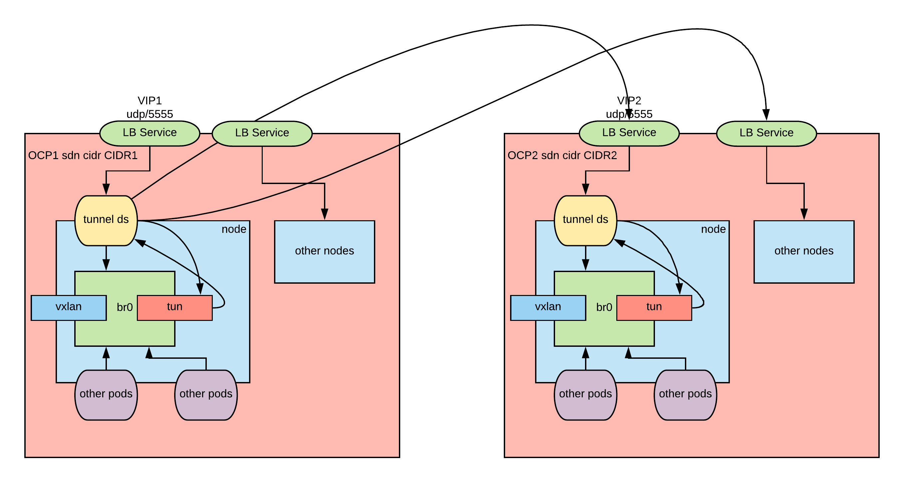
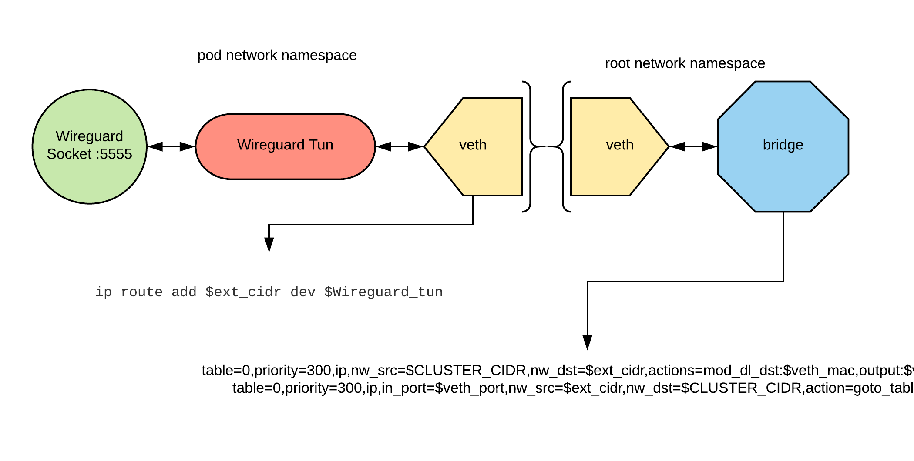

# OpenShift SDN Encrypted Tunnel

OpenShift SDN Ecnrypted tunnel will create a VPN mesh between OpenShift clyster SDNs in such a way that IP packets become routable between pods across SDNs.

The archietcture of the tunnel is depicted in this diagram:



The process works as follows

SETUP PHASE:

1. a tun device is created by the tunnel daemon set 
2. the tun is wired to the bridge so that ip packets destined to the CIDR of the other cluster are routed to the tunnel. 

TRANSMIT PHASE:

1. a packet is put in the bridge with destination to the CIDR of one of the nodes of the other cluster
2. the flow rules send the packet to the tunnel
3. the tunnel daemonset process manages the wired side of the tunnel and sends the UDP-encapsulated and encrypted packet to the correct VIP of the other cluster

RECEIVE PHASE:
 
1. A UDP encapsulated and encrypted packet is received by the VIP and sent to the corresponding tunnel ds process 
2. the tunnel daemonset process extracts and decrypts the packet from the UDP envelope and puts it in the tun device. 
3. the packet ends up in the bridge. 
4. the bridge examines the destination, which will be local to the node, and delivers the packet immediately. 


The routing of the packets works as described in this diagram:



## Installation

These instructions will help you install an encrypted tunnel between different OpenShift clusters.

### Install wireguard

Wireguard needs to be installed in each of the nodes of your clusters.

For each of your clusters run the following:

```
ansible nodes -i <cluster_inventory> -m shell -a "curl -Lo /etc/yum.repos.d/wireguard.repo https://copr.fedorainfracloud.org/coprs/jdoss/wireguard/repo/epel-7/jdoss-wireguard-epel-7.repo"
ansible nodes -i <cluster_inventory> -m shell -a "wget https://dl.fedoraproject.org/pub/epel/epel-release-latest-7.noarch.rpm"
ansible nodes -i <cluster_inventory> -m shell -a "yum install -y epel-release-latest-7.noarch.rpm"
ansible nodes -i <cluster_inventory> -m shell -a "yum install -y wireguard-dkms wireguard-tools"

```

### Run the installation playbook

See an example of the inventory [here](./ansible/inventory) and customize it for your clusters.
Here is a minimum inventory:
```
clusters:
- name: <cluster_1_name>
  url: <cluster_1_master_api_url>
  username: <cluster_1_username>
  password: <cluster_1_password>  
- name: <cluster_2_name>
  url: <cluster2_master_api_url>
  username: <cluster_2_username>
  password: <cluster_2_password> 
```
Other optional inventory variables are:

| Variable Name  | Default  | Description  |
|:-:|:-:|:-:|
| tunnel_mode  | wireguard  | selects the tunnel mode. Currently only `wireguard` is supported.  |
| namespace  | sdn-tunnel  | namespace in which the sdn-tunnel objects will be created  |
| appname  | sdn-tunnel  | name and label shared by all the created resources  |
| tunnel_port  | 5555  | UDP port used to create the the tunnel  |
| image  | quay.io/raffaelespazzoli/istio-mesh-extension:latest  | image used by the daemonset  |
| serviceType | LoadBalancer | type of the service used to create the tunnel, supported values are `LoadBalancer` and `NodePort` |


Run the playbook:
```
ansible-playbook -i <inventory> ./ansible/playbooks/deploy-wireguard/config.yaml
```

# Test

We are going to create two podsin two different cluster and test the connectivity.

Login to the cluster and save the context in a variable:
```
oc login --username=<user1> --password=<pwd1> <url1>
CLUSTER1=$(oc config current-context)
oc login --username=<user2> --password=<pwd2> <url2>
CLUSTER2=$(oc config current-context)
```

create a project and a pod:
```
oc --context=$CLUSTER1 new-project test-sdn-tunnel
oc --context=$CLUSTER2 new-project test-sdn-tunnel
oc --context=$CLUSTER1 new-app -n test-sdn-tunnel --name httpd registry.access.redhat.com/rhscl/httpd-24-rhel7~https://github.com/openshift/httpd-ex.git
oc --context=$CLUSTER2 new-app -n test-sdn-tunnel --name httpd registry.access.redhat.com/rhscl/httpd-24-rhel7~https://github.com/openshift/httpd-ex.git
```
after a while the pod will be up and running
collect the info needed for the test
```
POD1=$(oc --context $CLUSTER1 get pod -n test-sdn-tunnel | grep Running | awk '{print $1}')
POD2=$(oc --context $CLUSTER2 get pod -n test-sdn-tunnel | grep Running | awk '{print $1}')
POD1_IP=$(oc --context $CLUSTER1 get pod $POD1 -n test-sdn-tunnel -o jsonpath='{.status.podIP}')
POD2_IP=$(oc --context $CLUSTER2 get pod $POD2 -n test-sdn-tunnel -o jsonpath='{.status.podIP}')
SVC1_IP=$(oc --context $CLUSTER1 get svc -n test-sdn-tunnel | grep httpd | awk '{print $3}')
SVC2_IP=$(oc --context $CLUSTER2 get svc -n test-sdn-tunnel | grep httpd | awk '{print $3}')
```
Let's test simple ip to ip connectivity
```
oc --context $CLUSTER1 exec $POD1 -n test-sdn-tunnel -- curl http://$POD2_IP:8080
```

Let's test connectivity via the service
```
oc --context $CLUSTER1 exec $POD1 -n test-sdn-tunnel -- curl http://$SVC2_IP:8080
```
To test connectivity via name resolution we need to inform the pod on how to resolve the names
```
DNS_IP=$(oc --context $CLUSTER1 get svc -n sdn-tunnel | grep coredns | awk '{print $3}')
oc --context $CLUSTER1 patch dc httpd -n test-sdn-tunnel -p '{"spec":{"template":{"spec":{"dnsConfig":{"nameservers":["'$DNS_IP'"]}}}}}'
POD1=$(oc --context $CLUSTER1 get pod -n test-sdn-tunnel | grep Running | awk '{print $1}')
```
this will cause the pod to be redeployed, once the pod is up we can test name resolution:
```
CLUSTER_NAME=<add the name for the cluster that you used in the inventory file>
oc --context $CLUSTER1 exec $POD1 -n test-sdn-tunnel -- curl http://httpd.test-sdn-tunnel.svc.cluster.$CLUSTER_NAME:8080
```
